# The Rat (Bluetooth Remote Controlled Car V0)

[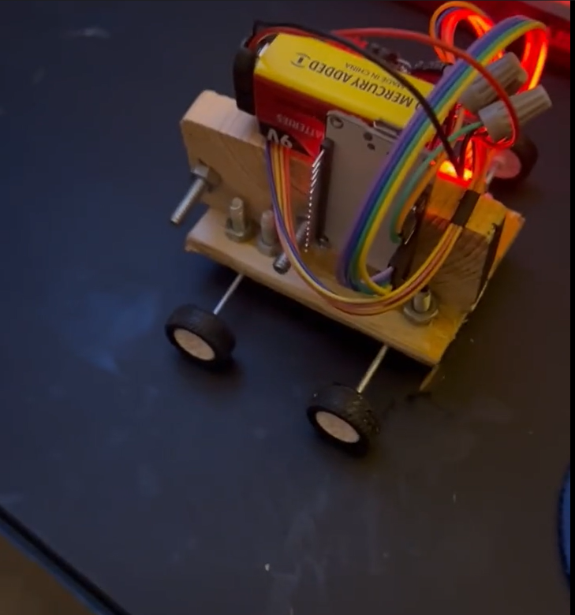](images/demo.mp4)

## Description

This is my prototype for an RC Car named: **The Rat**.

| 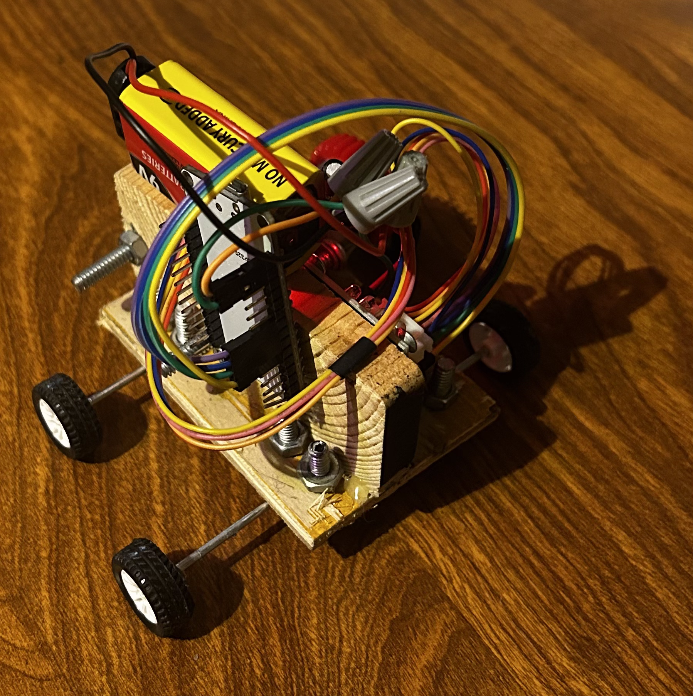 | 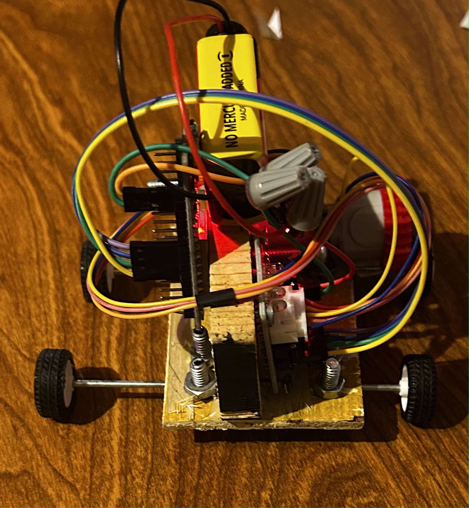 | 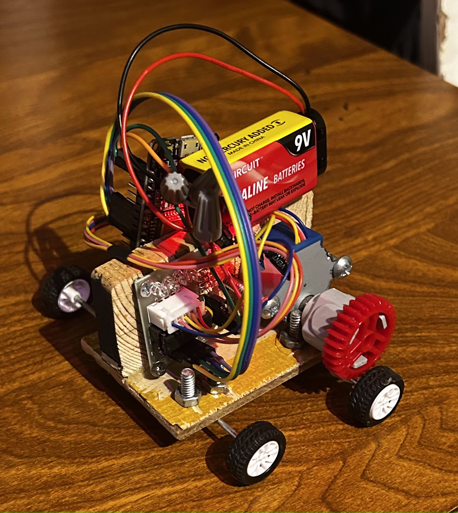 |
|-----|-----|-----|
| 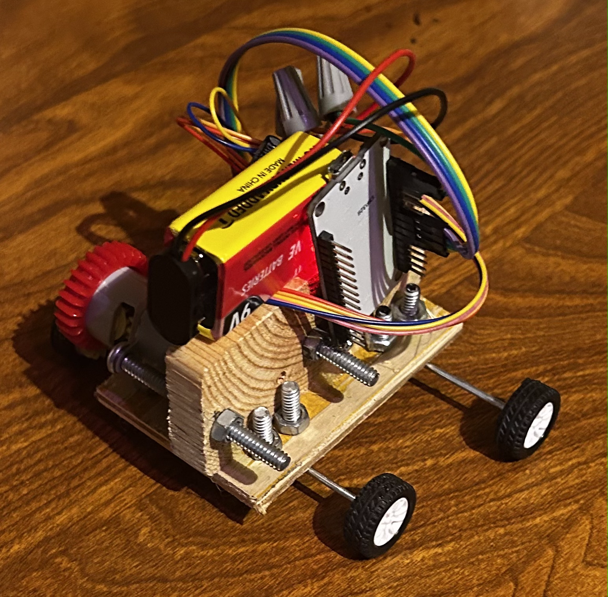 | 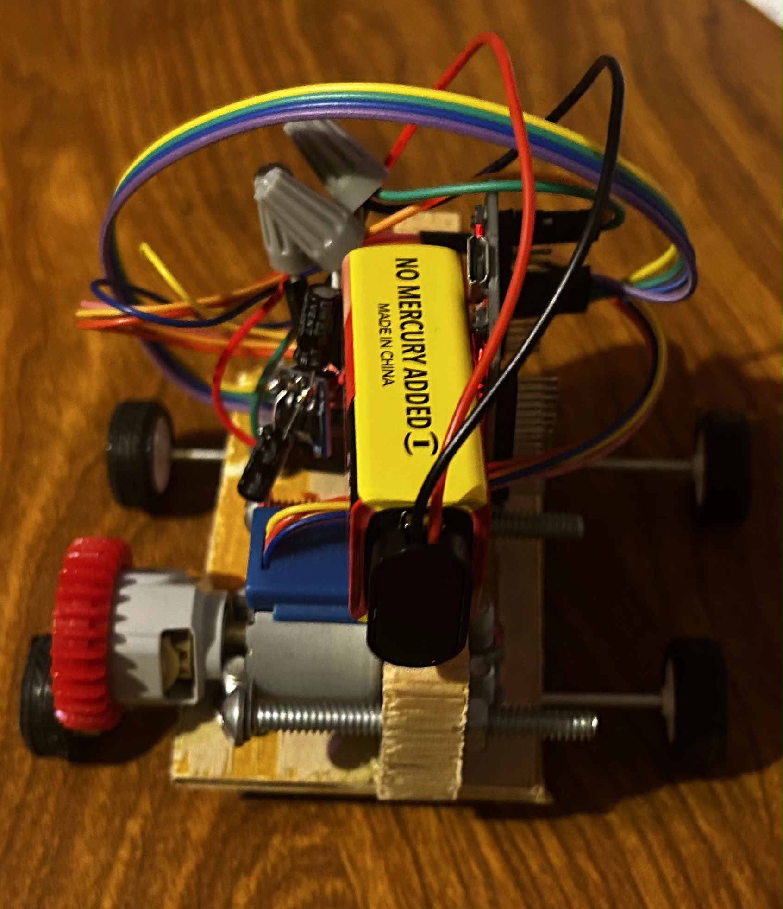 | 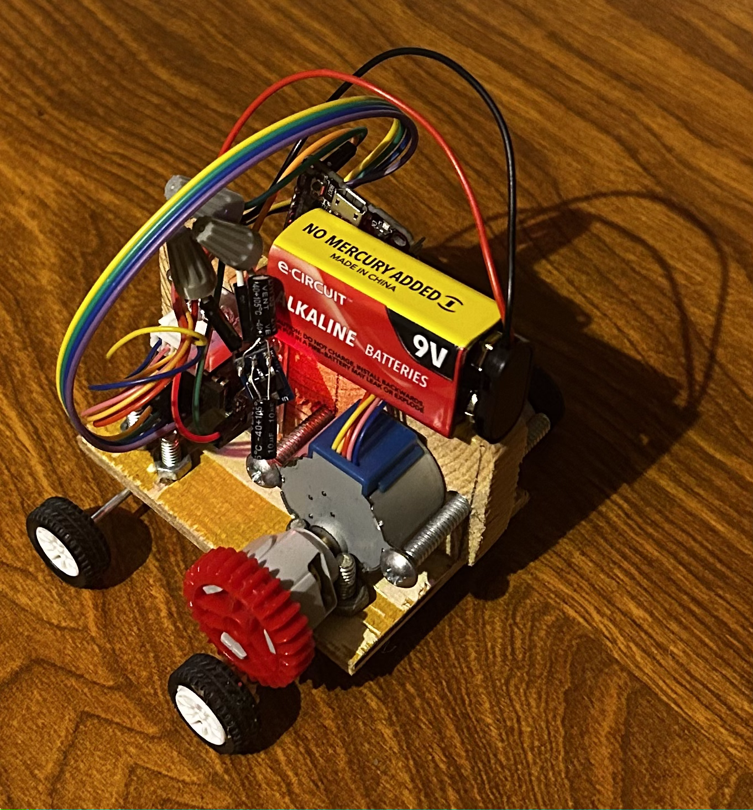 |

The car's axle uses gears to rotate with a **28BYJ-48 5V Stepper Motor** and the **ULN2003 motor driver** which is controlled using an **ESP32 Devkit V1 DOIT**.


It was assembled by [Estela Guzman](https://estelaguzman1220.wixsite.com/mysite). The body is built out of wood and extremities (u-bolts under the body securing the axles, microcontroller, motor and driver) are screwed/bolted on to secure it. The 9V is not tied down to change out easily.

The ESP32 triggers the motor using [Arduino](https://docs.arduino.cc/libraries/stepper/)'s `Stepper.h` library with an XBOX One remote controller that is connected through BlueTooth using [Ricardo Quesada](https://github.com/ricardoquesada)'s `Bluepad32.h`.

This project largely uses the instructions provided in the following articles:

| [Stepper Motor Control](https://lastminuteengineers.com/28byj48-stepper-motor-arduino-tutorial/) | [BlueTooth Game Controller](https://bluepad32.readthedocs.io/en/latest/plat_arduino/) |
|--------------|-------------------------|
| [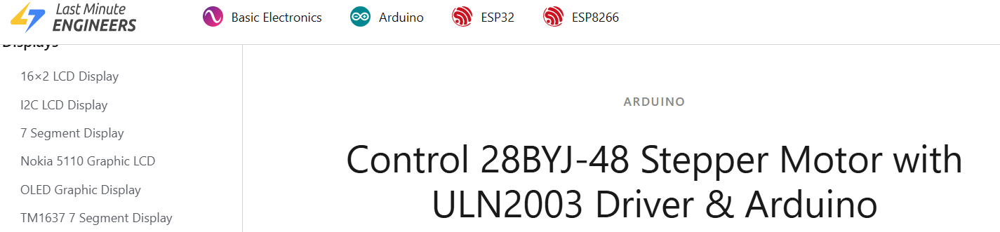](https://lastminuteengineers.com/28byj48-stepper-motor-arduino-tutorial/) | [](https://bluepad32.readthedocs.io/en/latest/plat_arduino/) |

## Parts List

**Main Components**

| ESP32 Devkit1 DOIT | 28BYJ-48 Stepper Motor w/ ULN2003 Driver Board | XBox One Controller |
| ------------------------ | --------------------------- | --------------- |
|      [](https://www.amazon.com/dp/B08D5ZD528?ref=ppx_yo2ov_dt_b_fed_asin_title&th=1)     |    [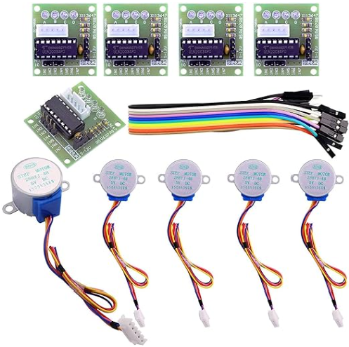](https://www.amazon.com/dp/B01CP18J4A?ref_=ppx_hzsearch_conn_dt_b_fed_asin_title_2)    | 

****

**Power Supply**

| AMS1117 Voltage Regulator | 9V Battery | 2x Capacitors |
|-------------------| -----------| ------------ |
| [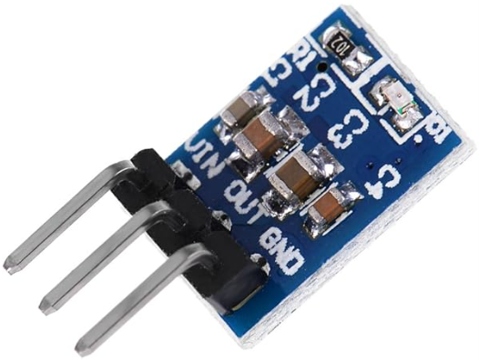](https://www.amazon.com/Anmbest-AMS1117-3-3-4-75V-12V-Voltage-Regulator/dp/B07CP4P5XJ/) | 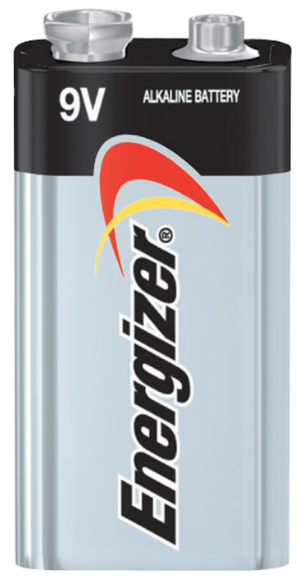 | 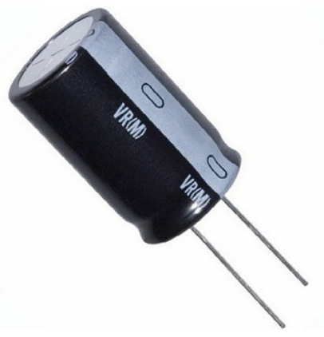 |

****

**Car Parts**

| Wheels & Axles | Gears |
|--------|---------|
| 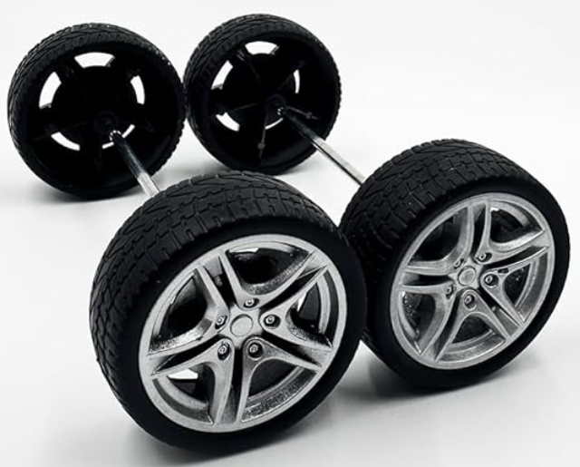 | 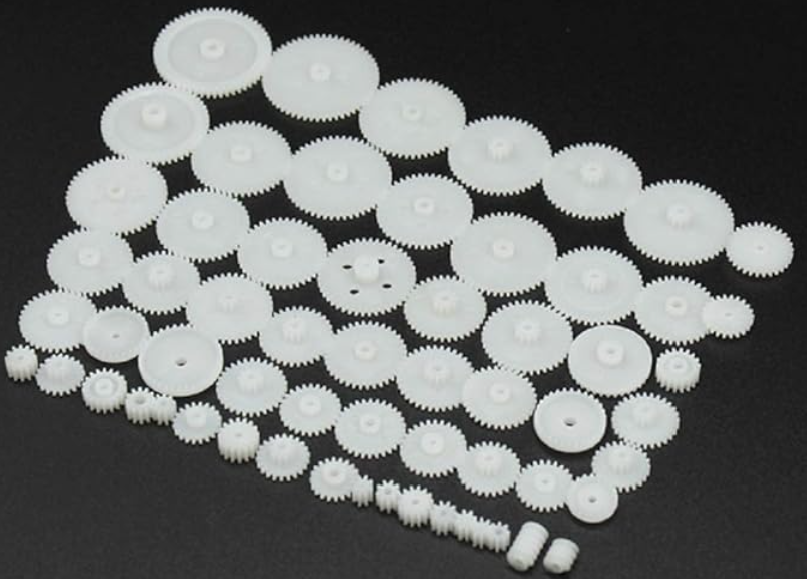 |

## Wiring Diagram

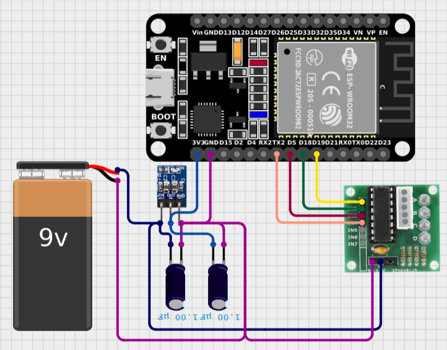

****

**Pinouts**

|ESP32 Devkit V1 - DOIT Pinout|28BYJ Stepper Motor Driver Pinout|AMS1117 Voltage Regulator Pinout|
|--------|----------------|--------------|
|||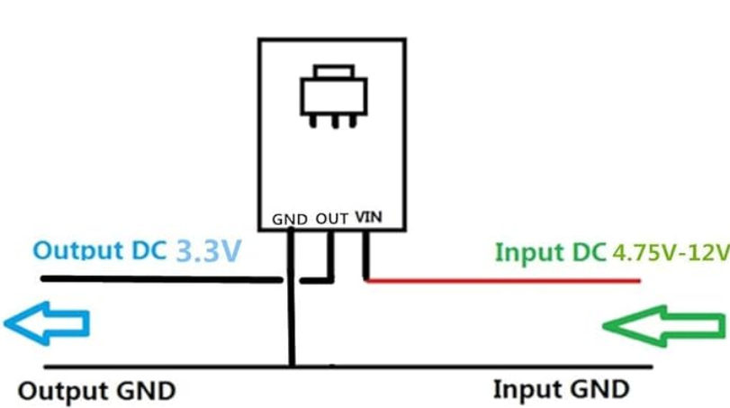|


## Flow Diagram


While this is a simplified block diagram, it captures the necessary *big picture* aspects of the code. The **pseudocode** goes into some more detail in the style of C++.

## Pseudocode

```
#include <Stepper.h>
#include <Bluepad32.h>

const int stepsPerRevolution = 2048; // 32 steps with gear reduction of 64:1 -> 32*64=2048
const int stepSize = floor(stepsPerRevolution/360);

Stepper myStepper(stepsPerRevolution, D19, D5, D18, TX2);

int32_t throttle; // 0 -> 1023
int32_t brake; // 0 -> 1023

void setup() {
  Serial.begin(115200);

  stepperSetup();

  bluetoothSetup();
}

void drive() {
  if (throttle > 100) {
    myStepper.step(stepSize);
  }

  if (brake > 100) {
    myStepper.step(-stepSize);
  }

  if (!(throttle > 100 || brake > 100)) {
    driveAllLow(IN1, IN2, IN3, IN4);
  }
}

void loop() {
  drive();
  
  bool dataUpdated = BP32.update();

  if (dataUpdated) processControllers();
}

```

**Code Description**

This code was written with the Arduino IDE and it uses both:
* The [`Bluepad32.h`](https://bluepad32.readthedocs.io/en/latest/plat_arduino/) library
* Arduino's [`Stepper.h`](https://docs.arduino.cc/libraries/stepper/) library

Define/Initialize variables.

`setup()`:
* `Serial.begin(115200)`: Initialize serial interface
* `stepperSetup()`: Setup the stepper motor (set initial motor speed)
* `bluetoothSetup()`: Setup the microcontroller to properly connect and disconnect from BlueTooth Controllers

`loop()`:
* `drive()`: Drives based on the `throttle` and `brake` values
* `dataUpdated`: Check if the microcontroller's Bluetooth data has changed since last update
* `processControllers()`: Process altered (dataUpdated?) inputs from controllers to update the `throttle` and `brake` values

## Conclusions & Further Work

**The Rat** successfully drives using the Bluetooth connected XBox One controller powered by a 9V Battery.

I intend to get better wheels, axles, and gears.

My next iteration will incorporate tank controls (control left and right wheels with the left and right analog stick, respectively). This will require another motor and possibly an alternative power solution.